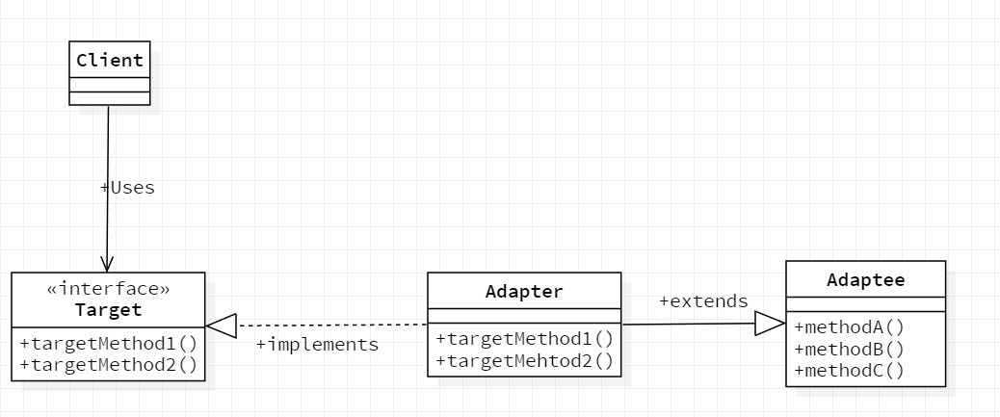
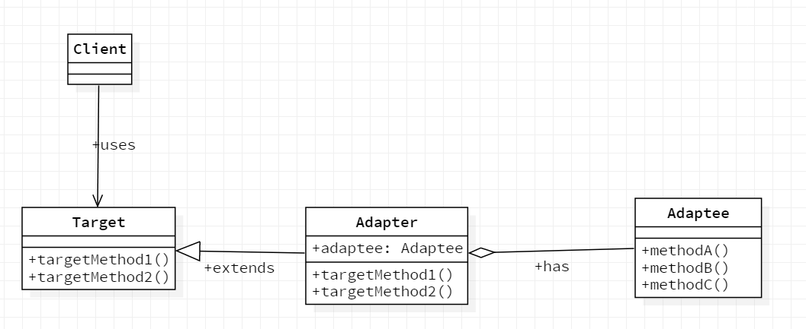

## Adapter模式

Adapter模式也被称为Wrapper模式。Wrapper有“包装器”的意思，就像用精美的包装纸将普通商品包装成礼物那样，替我们把某样东西包装起来，使其能够用于其它用途的东西被称为“包装器”或是“适配器”。

### Adapter模式作用

在开发时，很多时候并不是从零开始的。在开发过程中经常会用到现有的类，特别是现有的类经过了测试，bug很少。往往将这些类作为组件重复利用。

Adapter模式会对现有类进行适配，生成新的类。通过该模式可以方便的创建我们需要的方法群。当出现bug时，由于我们很明确的知道bug不在被适配类中，所以仅仅需要调查Adapter角色的类即可，这样代码的问题就会变得很简单了。

在软件的版本升级与解决软件兼容性问题的时候也可以使用Adapter模式解决。在新版本与旧版本之间出现兼容性问题时，可以通过编写adapter角色的类来解决。

### Adapter模式的角色

- Target（对象）

  负责定义所需的方法。

- Client（请求者）

  负责使用Target角色所定义的方法进行具体处理。

- Adaptee（被适配者）

  需要适配的角色

- Adapter（适配器）

  Adapter模式的主人翁。使用Adapter角色的方法满足Target角色的需求，这是Adapter模式的目的，也是adapter角色的作用。

### Adapter模式种类

- 类适配器模式（使用继承的适配器）
- 对象适配器模式（使用委托的适配器）


#### 类适配器模式

adapter类继承adaptee类并实现Target接口。

**类图如下：**




#### 对象适配器模式

adapter继承target类

adapter类与adaptee类的关系是组合，将adaptee的对象保存在adapter的一个属性中。

**类图如下：**




### Java中的适配器模式

以Java中OutputStreamWriter类为例。

JavaJDK中OutputStreamWriter类使用的是对象适配器模式（使用委托的适配器）。

首先看OutputStreamWriter类的部分源码：

```java

public class OutputStreamWriter extends Writer {

    private final StreamEncoder se;

    //......

    /**
     * Writes a portion of an array of characters.
     *
     * @param  cbuf  Buffer of characters
     * @param  off   Offset from which to start writing characters
     * @param  len   Number of characters to write
     *
     * @throws  IndexOutOfBoundsException
     *          If {@code off} is negative, or {@code len} is negative,
     *          or {@code off + len} is negative or greater than the length
     *          of the given array
     *
     * @throws  IOException  If an I/O error occurs
     */
    public void write(char cbuf[], int off, int len) throws IOException {
        se.write(cbuf, off, len);
    }

    //......
    
}
```


查看上述部分源码，大体可以猜到：

OutputStreamWriter是Adapter角色

Writer类是Target角色

StreamEncoder类是Adaptee角色


下面查看Write类的部分源码：

```java
public abstract class Writer implements Appendable, Closeable, Flushable {
    
    //......
    
    /**
     * Writes a portion of an array of characters.
     *
     * @param  cbuf
     *         Array of characters
     *
     * @param  off
     *         Offset from which to start writing characters
     *
     * @param  len
     *         Number of characters to write
     *
     * @throws  IndexOutOfBoundsException
     *          Implementations should throw this exception
     *          if {@code off} is negative, or {@code len} is negative,
     *          or {@code off + len} is negative or greater than the length
     *          of the given array
     *
     * @throws  IOException
     *          If an I/O error occurs
     */
    public abstract void write(char cbuf[], int off, int len) throws IOException;
    
    //......
}
```


然后，在看StreamEncoder类的部分源码：

```java
public class StreamEncoder extends Writer {
    
    //......
    
    public void write(char cbuf[], int off, int len) throws IOException {
        synchronized (lock) {
            ensureOpen();
            if ((off < 0) || (off > cbuf.length) || (len < 0) ||
                ((off + len) > cbuf.length) || ((off + len) < 0)) {
                throw new IndexOutOfBoundsException();
            } else if (len == 0) {
                return;
            }
            implWrite(cbuf, off, len);
        }
    }
    
    //......
}
```


此时Client角色可以这样编写，来使用OutputStreamWrite类(代码编写不完整，只是表示Client角色使用Adapter模式的一种方式)：

```java
public class Client {
    public static void main(String[] args) {
        
        //......
        
        Write write = new OutputStreamWrite(.....);
        write.write(cbuf, off, len);
        
        //......
        
    }
}
```


### 编写FileProperties（类适配器模式）

将FileProperties作为adapter角色，将java.util.Properties类作为adaptee角色，将FileIO接口作为Target角色，编写FileProperties类。（FileIO接口如下）

```java
/**
 * 给出的FileIO接口
 */
import java.io.IOException;

public interface FileIO {
	
	public void readFromFile(String filename) throws IOException;
	
	public void writeToFile(String filename) throws IOException;
	
	public void setValue(String key, String value);
	
	public String getValue(String key);
}
```


接下来是编写的是adapter适配器类——FileProperties

```java
import java.io.FileInputStream;
import java.io.FileOutputStream;
import java.io.IOException;
import java.util.Properties;

public class FileProperties extends Properties implements FileIO {

	@Override
	public void readFromFile(String filename) throws IOException {
		load(new FileInputStream(filename));		
	}

	@Override
	public void writeToFile(String filename) throws IOException {
		store(new FileOutputStream(filename), "");		
	}

	@Override
	public void setValue(String key, String value) {	
		setProperty(key, value);
	}

	@Override
	public String getValue(String key) {
		return getProperty(key);
	}

}

```


编写测试类测试正确性：

```java
import static org.junit.jupiter.api.Assertions.*;

import java.io.IOException;

class Test {

	@org.junit.jupiter.api.Test
	void test() {
				
		FileIO file = new FileProperties();
		try {
			file.setValue("hu", "帅");
			file.writeToFile("F:\\Code\\JavaStudy4\\SpringBoot\\GOF\\fileProperties.TXT");
		} catch (IOException e) {
			// TODO Auto-generated catch block
			e.printStackTrace();
		}
	}
	
	@org.junit.jupiter.api.Test
	void test2() {
				
		FileIO file = new FileProperties();
		try {
			file.readFromFile("F:\\Code\\JavaStudy4\\SpringBoot\\GOF\\fileProperties.TXT");
			String value = file.getValue("hu");
			System.out.println(value);
		} catch (IOException e) {
			// TODO Auto-generated catch block
			e.printStackTrace();
		}
	}

}

```

