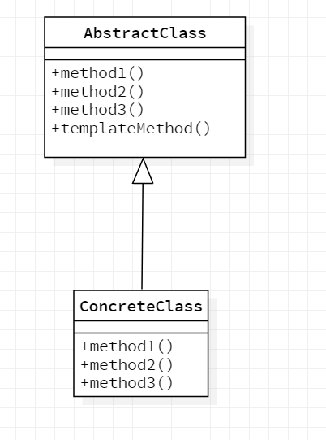

## Template Method 模式

在父类中定义处理流程的框架，在子类中实现具体处理的模式称之为Template Method模式。

### Template Method模式的角色

- AbstractClass（抽象类）

  AbstractClass不仅负责实现**模板方法**，还负责声明在模板方法中所使用到的抽象方法。这些抽象方法由子类ConcreteClass角色负责实现。

- ConcreteClass（具体类）

  负责实现AbstractClass角色中定义的抽象方法。这里实现的方法将会在AbstractClass角色的模板方法中调用。

### Template Method模式类图




其中AbstractClass类中method1()、method2()、method3()是抽象方法， templateMethod()是模板方法。

### Java中TemplateMethod模式

以java.io.InputStream类为例

InputStream是上述的AbstractClass角色：

看Java源码：

```java
public abstract class InputStream implements Closeable {
    
    //......
    
    // 这是抽象方法，该抽象方法需要在子类中实现
    public abstract int read() throws IOException;

    public int read(byte[] var1) throws IOException {
        return this.read(var1, 0, var1.length);
    }

    //这是模板方法
    public int read(byte[] var1, int var2, int var3) throws IOException {
        Objects.checkFromIndexSize(var2, var3, var1.length);
        if (var3 == 0) {
            return 0;
        } else {
            int var4 = this.read();//使用了上述的抽象方法
            if (var4 == -1) {
                return -1;
            } else {
                var1[var2] = (byte)var4;
                int var5 = 1;

                try {
                    while(var5 < var3) {
                        var4 = this.read();
                        if (var4 == -1) {
                            break;
                        }

                        var1[var2 + var5] = (byte)var4;
                        ++var5;
                    }
                } catch (IOException var7) {
                }

                return var5;
            }
        }
    }
    //......
}
```


接下来查看InputStream的子类：

这里子类以StringBufferInputStream类为例， 它的read()方法实现如下：

```java
public synchronized int read() {
        return this.pos < this.count ? this.buffer.charAt(this.pos++) & 255 : -1;
    }
```


